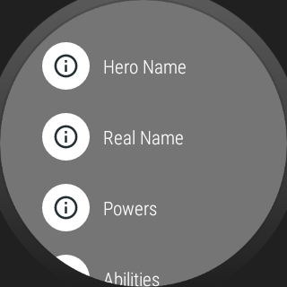
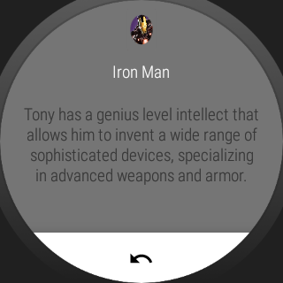

# WearMarvel

Exemplo usando WearableRecyclerView + WearableDrawerAction + WearableDrawerNavegation 

Example
--------

Trabalho Cadeira de Wearables
--------
Professor : Leandro Malkes (leo.malkes@gmail.com)
